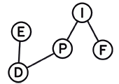

This is a basic introductory course in machine learning and statistical inference, with an emphasis on simple methods, theoretical understanding and practical exercises. The course will combine (and alternate) between methodology with theoretical foundations and practical computational aspects with exercices in python, using scikit-learn and pytorch. The topics will be chosen from the following basic outline:

* Statistical theory : Maximum likelihood, Bayes, VC Bounds and Uniform convergence
* Supervised learning : Linear Regression, Ridge, Lasso, high Dimensional Data, Kernel methods, Boosting 
* Deep learning: multi-layer net, conv-net, auto-encoder
* Unsupervised learning : Mixture Models, PCA & Kernel PCA
* Basics of Generative models & Reinforcement learning

### Computer requirement

All exercices will be in python. For practical installation, we recommand
(especially for apple computers) [Anaconda](http://anaconda.org).  More precisly, we shall use
Python 3.7, with the following modules: numpy, scipy, matplotlib,
pandas, h5py, datasets, scikit-learn and scikit-image. All these can be installed
within anaconda, or with pip. 

For deep-learning, we shall use keras (version >= 2.2.4) and tensorflow (version >= 1.13.1) . All the exercices will be given as <a href="https://jupyter.org/install">jupyter notebooks</a>, so jupyter should be installed as well. We will also use pytorch later in the course.

### Lectures topic

* Lecture 1: Introduction to supervised machine learning. KNN, linear models, optimization. Some words on VC and Rademacher  bounds [[slides]](https://github.com/sphinxteam/mlcourse_2019/blob/master/slides/lec1_ml_2019.pdf),[[notebooks]](https://github.com/sphinxteam/mlcourse_2019/tree/master/lec1) 
* Lecture 2: Kernel trick, Kernels methods, and random features,[[notebooks]](https://github.com/sphinxteam/mlcourse_2019/tree/master/lec2)
* Lecture 3: Unsupervised learning with PCA and Kernel PCA, Ensemble methods (Boosting and Bagging)
[[notebooks]](https://github.com/sphinxteam/mlcourse_2019/tree/master/lec3)
* Lecture 4: How to work with	data part 1
[[notebooks]](https://github.com/sphinxteam/mlcourse_2019/tree/master/lec4)
* Lecture 5: How to work with data part 2
* Lecture 6: Introduction to Neural network and deep learning [[notebooks]](https://github.com/sphinxteam/mlcourse_2019/tree/master/lec6)
* Lecture 7: Some special architecture: CNN, RNN and LSTM [[notebooks]](https://github.com/sphinxteam/mlcourse_2019/tree/master/lec7)
* Lecture 8: Introduction to reinforcement learning

### Where and when?

Inscription should be made with the "Ecole Doctorale EDPIF" : [e-mail](<edpif.psl@edpif.org>)

Lecture will be on monday in April and May 2019, in Ecole Normale Superieure in Paris, in the physics department, Rue Lhomond, at the third floor. The lectures in will be in room  L357 from  9h to 10h30, followed by practical exercices in room L363 and L378.

There will be eight sessions: april 1,8,15,29 and may  6,13,20,27.

### A list of references

* A good book for probability and statistics, accessible to students, is Larry A. Wasserman 's <a href="https://www.ic.unicamp.br/~wainer/cursos/1s2013/ml/livro.pdf">All of Statistics</a>
* A good introduction to statistical learning is given in <a href="https://web.stanford.edu/~hastie/ElemStatLearn/">Elements of Statistical Learning </a> by Jerome H. Friedman, Robert Tibshirani, and Trevor Hastie.
* Another great reference is <a href="https://www.amazon.com/Machine-Learning-Probabilistic-Perspective-Computation/dp/0262018020">Machine Learning:A Probabilistic Perspective<a/> by Kevin P. Murphy.
* Deep learning is well covered in this new book:
<a href="http://d2l.ai/">Dive into Deep Learning<a/> by A. Zhang, Z. Lipton, M. Li, A.J. Smola. 
* Un recent, et excellent, livre de reference en Francais: <a href="https://www.amazon.fr/Introduction-Machine-Learning-Chloé-Agathe-Azencott/dp/2100780808">Introduction au Machine Learning </a> par Chloé-Agathe Azencott. 
* A very nice review on <a href="https://arxiv.org/abs/1903.10563"> machine learning for physics </a>.
* An introduction to <a href="https://arxiv.org/abs/1803.08823">machine learning for physicists</a>.
  
### Many thanks to...

 
 
 

